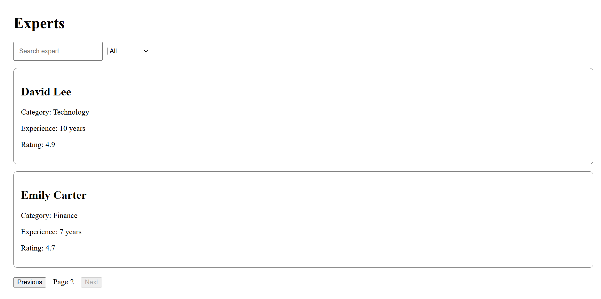
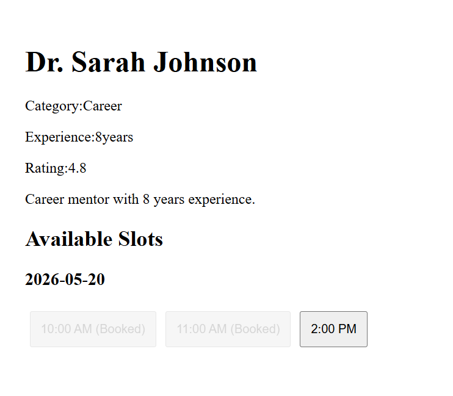
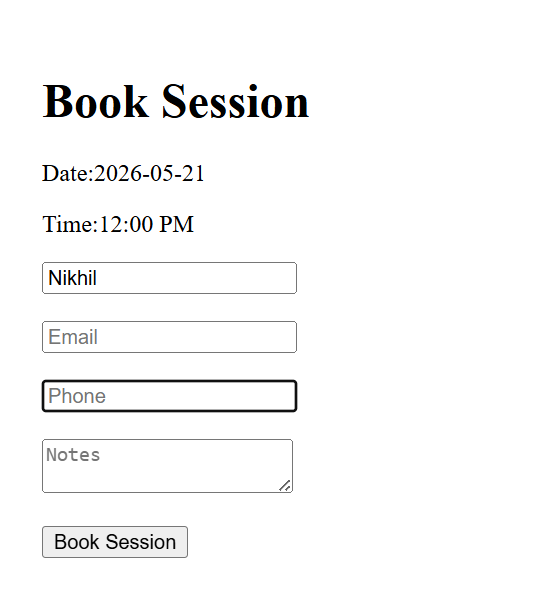
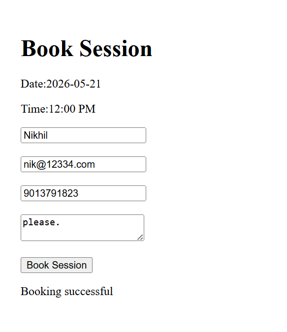

# Real-Time Expert Session Booking System

A full-stack booking platform that enables users to discover experts, browse available time slots, and schedule appointments with real-time synchronization. The system is designed to handle concurrent booking requests safely and prevent double-booking conflicts.

## Project Status

✅ Core Features Implemented

🚧 Authentication Pending

🚧 Deployment Pending

---

## Live Demo

Frontend: https://expert-booking-system-eight.vercel.app/

Backend: https://expertbookingsystem-f9rh.onrender.com

---

## Screenshots

### Expert Listings




### Expert Details




### Booking Flow




---

## Features

### Expert Discovery

* Browse expert profiles
* View expert details
* Search experts by name
* Filter experts by category
* Paginated expert listings

### Appointment Booking

* View available time slots
* Book appointments in real time
* Track booking status
* Automatic slot updates

### Real-Time Functionality

* Live slot synchronization using Socket.io
* Instant updates across connected clients
* Prevention of stale booking data

### Booking Integrity

* Race-condition-safe booking logic
* Double-booking prevention
* Slot locking and validation workflows

---

## Technical Highlights

- Implemented race-condition-safe booking workflows
- Built real-time slot synchronization using Socket.io
- Designed modular MVC backend architecture
- Prevented duplicate reservations during concurrent booking requests
- Developed scalable REST APIs with MongoDB integration

---

## Tech Stack

### Frontend

* React
* Vite
* CSS

### Backend

* Node.js
* Express.js
* Socket.io

### Database

* MongoDB

---

## System Architecture

React Frontend
↓
Express.js REST APIs
↓
MongoDB Database
↓
Socket.io Real-Time Updates

The frontend communicates with Express APIs for expert discovery and booking operations, while Socket.io ensures real-time synchronization of slot availability across multiple users.

---

## Project Structure

```text
ExpertBookingSystem
├── client
│   ├── public
│   └── src
│
├── server
│   ├── src
│   └── .env
```

### Client

Responsible for:

* Expert listing
* Search and filtering
* Booking interface
* Real-time slot updates

### Server

Responsible for:

* REST API endpoints
* Booking validation
* Database interactions
* Socket.io event handling

---

## Key Technical Challenges

### Preventing Double Booking

Multiple users may attempt to book the same slot simultaneously.

To solve this, booking requests are validated on the server and protected through race-condition-safe booking logic that prevents duplicate reservations.

### Real-Time Slot Synchronization

Socket.io broadcasts slot updates to connected clients so users always see the latest availability without refreshing the page.

---

## Installation

### Clone Repository

```bash
git clone https://github.com/nikonic23/ExpertBookingSystem.git
```

### Frontend

```bash
cd client
npm install
npm run dev
```

### Backend

```bash
cd server
npm install
npm start
```

### Environment Variables

Create a `.env` file inside the server directory:

```env
MONGODB_URI=your_connection_string
PORT=5000
```

---

## Future Improvements

* User Authentication & Authorization
* Expert Dashboard
* Payment Integration
* Email Notifications
* Calendar Integration
* Docker Deployment
* Automated Testing

---

## Author

Nikhil Munda

GitHub: https://github.com/nikonic23